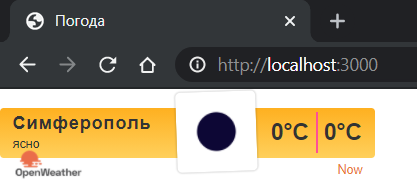
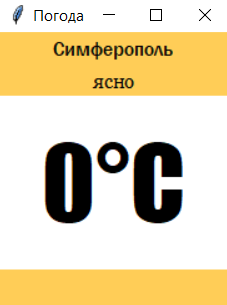

<p align="center">МИНИСТЕРСТВО НАУКИ  И ВЫСШЕГО ОБРАЗОВАНИЯ РОССИЙСКОЙ ФЕДЕРАЦИИ<br>
Федеральное государственное автономное образовательное учреждение высшего образования<br>
"КРЫМСКИЙ ФЕДЕРАЛЬНЫЙ УНИВЕРСИТЕТ им. В. И. ВЕРНАДСКОГО"<br>
ФИЗИКО-ТЕХНИЧЕСКИЙ ИНСТИТУТ<br>
Кафедра компьютерной инженерии и моделирования</p>
<br>
<h3 align="center">Отчёт по лабораторной работе № 1<br> по дисциплине "Программирование"</h3>

<br><br>

<p>студента 1 курса группы ПИ-б-о-201(2)<br>
Ратковского Георгия Витальевича<br>
направления подготовки 09.03.04 "Программная инженерия"</p>


<br><br>
<table>
<tr><td>Научный руководитель<br> старший преподаватель кафедры<br> компьютерной инженерии и моделирования</td>
<td>(оценка)</td>
<td>Чабанов В.В.</td>
</tr>
</table>
<br><br>

<p align="center">Симферополь, 2020</p>
<hr>

## Постановка задачи


Разработать сервис предоставляющий данные о погоде в городе Симферополе на момент запроса.  В качестве источника данных о погоде используйте: http://openweathermap.org/. В состав сервиса входит: серверное приложение на языке С++ и клиентское приложение на языке Python.

Серверное приложение (далее Сервер) предназначенное для обслуживания клиентских приложений и минимизации количества запросов к сервису openweathermap.org. Сервер должен обеспечивать возможность получения данных в формате JSON и виде html виджета (для вставки виджета на страницу будет использоваться iframe).

Клиентское приложение должно иметь графический интерфейс отображающий сведения о погоде и возможность обновления данных по требованию пользователя.

Подробности указаны далее.

## Цель работы
* Закрепить навыки работы с json
* Закрепить навыки работы с многофайловыми приложениями
* Получить базовое представление о взаимодействии приложений посредством создания клиент-сервеного приложения

## Выполнение работы
#### Подготовка к созданию программы
1. Регистрируемся на openweathermap.org и получаем api-ключ. Вот мой: ```bb693a45bf038ad8c1cc887c8a5bd872```
2. Составляем запрос (пункт I.7) на получение прогноза погоды для Симферополя с почасовым интервалом, в градусах Цельсия, на русском языке. Составленный мной запрос: ```http://api.openweathermap.org/data/2.5/onecall?id=524901&lat=44.95719&lon=34.11079&exclude=current,minutely,daily,alerts&units=metric&lang=ru&appid=bb693a45bf038ad8c1cc887c8a5bd872```
3. Составляем запрос (пункт II) для получения времени в Симферополе и изучите формат ответа. Составленный мной запрос: ```http://worldtimeapi.org/api/timezone/Europe/Simferopol```

#### Создание серверного приложения
Создаём серверное приложение. Сервер должен запускаться и слушать get запросы приходящие на 3000 порт localhost. Если приходит запрос на "/", сервер формирует и отправляет html-виджет. Если приходит запрос на "/raw", сервер формирует и отправляет json. При первом запуске, данные о погоде сервер получает с openweathermap.org записывает в пременную (кэш) откуда и "достаёт" их при каждом пользовательском запросе. Время данных о погоде в кэше сравниваются с текущим временем с worldtimeapi.org. Кэш обновляется, если данные устаревают. Полный исходный код сервера: 
<details>
<summary>Спойлер</summary>

```c++
#include <iostream>
#include <cpp_httplib/httplib.h>
#include <nlohmann/json.hpp>
#include <iomanip>
#include <fstream>

using json = nlohmann::json;
using std::cout;
using std::endl;
using std::string;
using std::ifstream;
using std::ofstream;
using namespace httplib;

void gen_response(const Request& req, Response& res);
void gen_response_raw(const Request& req, Response& res);

int main()
{
    Server weather;
    weather.Get("/", gen_response);
    weather.Get("/raw", gen_response_raw);
    cout << "Start server... OK\n";
    weather.listen("localhost", 3000);
}

json GetWeather()
{
    string req, adr, param, api;
    adr = "/data/2.5/onecall?id=524901&";
    param = "lat=44.95719&lon=34.11079&exclude=current,minutely,daily,alerts&units=metric&lang=ru&";
    api = "appid=bb693a45bf038ad8c1cc887c8a5bd872";
    req = adr + param + api;

    Client get_time("http://api.openweathermap.org");
    auto res = get_time.Get(req.c_str());
    if (res) {
        if (res->status == 200)
        {
            json result = res->body;
            return result;
        }
        else
        {
            cout << "Status code: " << res->status << endl;
        }
    }
    else
    {
        auto err = res.error();
        cout << "Error code: " << err << endl;
    }
}

string GetTime()
{
    Client get_time("http://worldtimeapi.org");
    auto res = get_time.Get("/api/timezone/Europe/Simferopol");
    if (res) {
        if (res->status == 200)
        {
            string result = res->body;
            return result;
        }
        else
        {
            cout << "Status code: " << res->status << endl;
        }
    }
    else
    {
        auto err = res.error();
        cout << "Error code: " << err << endl;
    }
}

bool is_empty_file(std::ifstream& pFile)
{
    return pFile.peek() == ifstream::traits_type::eof();
}

json CacheGenerator(ifstream& ReadCache)
{
    json RawCache;
    RawCache = GetWeather();
    ofstream wc("cache.json");
    cout << "Generating cache..." << endl;
    wc << std::setw(2) << RawCache << std::endl;
    return RawCache;
}

string StringRemoover(string FToRemoove, json cache, int curr_hour)
{
    string r1 = "{hourly[i].weather[0].description}";
    string r2 = "{hourly[i].weather[0].icon}";
    string r3 = "{hourly[i].temp}";

    double tempd = cache["hourly"][curr_hour]["temp"];
    string temps = std::to_string(int(round(tempd)));
    string desk = cache["hourly"][curr_hour]["weather"][0]["description"];
    string icon = cache["hourly"][curr_hour]["weather"][0]["icon"];

    FToRemoove.replace(FToRemoove.find(r1), r1.length(), desk);
    FToRemoove.replace(FToRemoove.find(r2), r2.length(), icon);
    FToRemoove.replace(FToRemoove.find(r3), r3.length(), temps);
    FToRemoove.replace(FToRemoove.find(r3), r3.length(), temps);
    return FToRemoove;
}

int WhatHour(json cache)
{
    int curr_hour = 100;
    long unixtime;

    json curr_time_full = json::parse(GetTime());
    unixtime = curr_time_full["unixtime"];
    for (int i = 0; i < 48; i++)
    {
        long w_unixtime = cache["hourly"][i]["dt"];
        if (unixtime < w_unixtime)
        {
            curr_hour = i;
            break;
        }
    }
    return curr_hour;
}

json CacheReader(ifstream& rc)
{
    json RawCache;
    bool not_exist_cache = !rc.is_open() or is_empty_file(rc);

    if (not_exist_cache)
    {
        RawCache = CacheGenerator(rc);
    }
    else
    {
        rc >> RawCache;
        cout << "Cache succesfully read" << endl;
    }
    return RawCache;
}

void gen_response_raw(const Request& req, Response& res)
{
    ifstream rc("cache.json");
    json RawCache = CacheReader(rc);
    string temp = RawCache;
    json cache = json::parse(temp);
    int curr_hour = WhatHour(cache);

    if (curr_hour == 100)
    {
        RawCache = CacheGenerator(rc);
        temp = RawCache;
        cache = json::parse(temp);
    }

    json WeatherData;
    double tempd = cache["hourly"][curr_hour]["temp"];
    int tempi = round(tempd);
    string desk = cache["hourly"][curr_hour]["weather"][0]["description"];

    WeatherData["temperature"] = tempi;
    WeatherData["description"] = desk;
    res.set_content(WeatherData.dump(), "text/json");
}

void gen_response(const Request& req, Response& res)
{
    ifstream rc("cache.json");
    json RawCache = CacheReader(rc);
    string temp = RawCache;
    json cache = json::parse(temp);
    int curr_hour = WhatHour(cache);

    if (curr_hour == 100)
    {
        RawCache = CacheGenerator(rc);
        temp = RawCache;
        cache = json::parse(temp);
    }

    string widget;
    ifstream rw("template.html");
    if (rw.is_open())
    {
        getline(rw, widget, '\0');
    }
    else
        cout << "Can`t open template";

    string output = StringRemoover(widget, cache, curr_hour);
    res.set_content(output, "text/html");
}
```
</details>
<br>

#### Создание клиентского приложения
Создаём клиентское приложение, которое будет посылать запросы на 3000 порт localhost, обрабатывать json файл и отображать погоду на текущий момент. Приложение создаётся на python с использованием библиотеки tkinter. Полный исходный код клиентского приложения:
<details>
<summary>Спойлер</summary>

```python
from tkinter import *
import json
import requests

def WeatherReload(event=None):
	r = requests.get('http://localhost:3000/raw').content.decode("UTF8")
	weather = json.loads(r)
	description.config(text=str(weather["description"]))
	temperature.config(text=str(weather["temperature"]) + "°C")

root = Tk()
root.title("Погода")
root.bind("<Button-3>", WeatherReload)
root.geometry("185x220")

TopFrame = Frame(root, bg="#ffcd57")
MiddleFrame = Frame(root, bg="white")
BottomFrame = Frame(root, bg="#ffcd57", height=30)

TopFrame.pack(side=TOP, fill=X)
MiddleFrame.pack(expand=True, fill=BOTH)
BottomFrame.pack(side=BOTTOM, fill=X)

city = Label(TopFrame, font=("Franklin Gothic Medium", 12), text="Симферополь", bg="#ffcd57")
description = Label(TopFrame, font=("Georgia", 12), bg="#ffcd57")
temperature = Label(MiddleFrame, font=("Impact", 60), bg="white")

city.pack()
description.pack()
temperature.pack(expand=True)

WeatherReload()
root.mainloop()
```
</details>
<br>

#### Внешний вид HTML-виджета и python-приложения

После выполнения вышеописанных действий, запуска сервера и перехода на порт 3000 localhost в браузере, видим следующий виджет:



*Рисунок 1. Виджет погоды в браузере*

После выполнения вышеописанных действий, запуска сервера, запускаем клиентское приложение. Видим следующее:



*Рисунок 2. Клиентское приложение*

## Вывод
* Были закреплены навыки работы в json
* Были изучены способы работы с api
* Были получены базовые знания о взаимодействии приложений