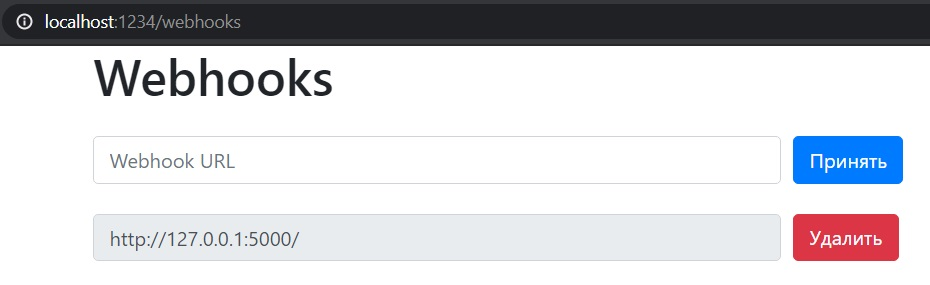
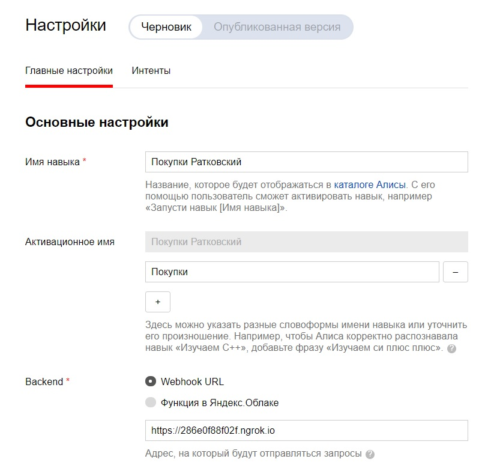

<p align="center">МИНИСТЕРСТВО НАУКИ  И ВЫСШЕГО ОБРАЗОВАНИЯ РОССИЙСКОЙ ФЕДЕРАЦИИ<br>
Федеральное государственное автономное образовательное учреждение высшего образования<br>
"КРЫМСКИЙ ФЕДЕРАЛЬНЫЙ УНИВЕРСИТЕТ им. В. И. ВЕРНАДСКОГО"<br>
ФИЗИКО-ТЕХНИЧЕСКИЙ ИНСТИТУТ<br>
Кафедра компьютерной инженерии и моделирования</p>
<br>
<h3 align="center">Отчёт по лабораторной работе № 2<br> по дисциплине "Программирование"</h3>

<br><br>

<p>студента 1 курса группы ПИ-б-о-201(2)<br>
Ратковского Георгия Витальевича<br>
направления подготовки 09.03.04 "Программная инженерия"</p>


<br><br>
<table>
<tr><td>Научный руководитель<br> старший преподаватель кафедры<br> компьютерной инженерии и моделирования</td>
<td>(оценка)</td>
<td>Чабанов В.В.</td>
</tr>
</table>
<br><br>

<p align="center">Симферополь, 2020</p>
<hr>

## Постановка задачи

1. Разработайте и зарегистрируйте навык для Алисы на сервисе Яндекс.Диалоги

2. В качестве backend-a для навыка реализуйте приложение на языке С++ выполняющее следующие функции:

    1. Составление продуктовой корзины:

        - Добавление продукта в корзину;
        - Удаление продукта из корзины;
        - Очистка корзины;
        - Вывод списка товаров в корзине;
        - Подсчёт стоимости товаров в корзине.

    2. Вывод справочной информации по навыку;

    3. Регистрацию webhook-ов сторонних сервисов;

    4. Отправку данных на сторонние сервисы. 

3. В качестве стороннего сервиса реализуйте приложение на языке Python выполняющее следующие функции:

    1. Ожидание данных о покупке;
    2. Сохранение поступивших данных в excel-документ.

Подробности указаны далее.

## Цель работы

- Получить представления о структуре post-запроса;
- Изучить webhooks как метод взаимодействия web-приложений;

## Выполнение работы

#### Подготовка к созданию программы

1. Изучаем информацию о post-запросах
2. Изучаем информацию о вебхуках

#### Создание серверного приложения

Создаём серверное приложение, генерирующее сайт с вебхуками посредством post- и get-запросов. Сервер "слушает" запросы, приходящие на `localhost` порт `1234` и генерирует страницу со списком вебхуков, которые кешируются в json-файл. При получении post-запроса (он отправляется при нажатии на страницк на кнопку `Принять` или `Удалить`) сервер смотрит, какой запос пришёл (на удаление или добавление вебхука соответственно) и удаляет вебхук/добавляет новый.



*Рисунок 1. Страница с вебхуками*

<details>
<summary>Исходный код</summary>

```c++
#include <iostream>
#include <string>
#include <iomanip>
#include <cpp_httplib/httplib.h>
#include <nlohmann/json.hpp>

using namespace httplib;
using json = nlohmann::json;
using std::string;
using std::cin;
using std::cout;
using std::endl;
using std::ofstream;
using std::ifstream;

const string replacerfull = "{webhooks_list}";
const string replacerone = "{Webhook URL}";
const string OneWebhookTemplate = u8R"(
<div class="form-row align-items-center">
    <div class="col">
        <input type="text" value="{Webhook URL}" class="form-control mb-2" disabled>
    </div>
    <div class="col">
        <button type="submit" name="del" value="{Webhook URL}" class="btn btn-danger mb-2">Удалить</button>
    </div>
</div>)";

ofstream logger("log.txt");

json config;

json config_open()
{
    ifstream config_cache("config.json");
    json config;
    logger << u8"Попытка открыть конфигурационный файл" << endl;
    if (config_cache.is_open())
    {
        config_cache >> config;
        logger << u8"Конфигурационный файл десериализирован" << endl;
    }
    else
    {
        logger << u8"Не удалость открыть конфигурационный файл" << endl;
        config["webhooks"] = json::array();
        logger << u8"Был создан json с пустым массивом" << endl;
    }

    return config;
}

void save_config(json config)
{
    ofstream config_cache("config.json");

    if (config_cache.is_open())
    {
        config_cache << config.dump(4);
        config_cache.close();
        logger << u8"Конфигурационный файл успешно обновлён" << endl;
    }
    else
    {
        logger << u8"Не удалось открыть конфигурационный файл" << endl;
    }
}

string gen_webhook_page()
{
    string webhooks_template, AllWebHooks;
    ifstream webhooks_cache("webhooks_template.html");

    if (webhooks_cache.is_open())
    {
        getline(webhooks_cache, webhooks_template, '\0');
        webhooks_cache.close();
    }
    else
    {
        logger << u8"Не удалось открыть шаблон сайта" << endl;
        return "";
    }

    if (config.empty())
    {
        config = config_open();
    }

    int size = config["webhooks"].size();
    if (size)
    {
        for (int i = 0; i < size; i++)
        {
            string site = config["webhooks"][i];
            string OneWebhook = OneWebhookTemplate;
            OneWebhook.replace(OneWebhook.find(replacerone), replacerone.length(), site);
            OneWebhook.replace(OneWebhook.find(replacerone), replacerone.length(), site);
            AllWebHooks = AllWebHooks + OneWebhook;
        }
        webhooks_template.replace(webhooks_template.find(replacerfull), replacerfull.length(), AllWebHooks);
    }
    else
    {
        webhooks_template.replace(webhooks_template.find(replacerfull), replacerfull.length(), "");
    }
    return webhooks_template;
}

void webhooks_post_resp(const Request& req, Response& res)
{
    if (config.empty())
    {
        config = config_open();
    }

    if (req.has_param("del"))
    {
        string webhook_to_remove = req.get_param_value("del");
        int size = config["webhooks"].size();
        for (int i = 0; i < size; i++)
        {
            string webhook = config["webhooks"][i];
            if (webhook == webhook_to_remove)
            {
                config["webhooks"].erase(config["webhooks"].begin() + i);
                logger << u8"Был удалён вебхук " << webhook << endl;
                break;
            }
        }
    }
    else if (req.has_param("set"))
    {
        string webhook_to_add = req.get_param_value("set");
        if (webhook_to_add == "")
        {
            logger << u8"Получен запрос на добавление пустого вебхука" << endl;
        }
        else
        {
            logger << u8"Получен запрос на добавление вебхука " << webhook_to_add << endl;
            int size = config["webhooks"].size();
            bool existence = false;
            if (size)
            {
                for (int i = 0; i < size; i++)
                {
                    string webhook = config["webhooks"][i];
                    if (webhook == webhook_to_add)
                    {
                        logger << u8"Этот вебхук уже существует" << webhook << endl;
                        existence = true;
                        break;
                    }
                }
            }
            if (!existence)
            {
                logger << u8"Был добавлен вебхук " << webhook_to_add << endl;
                config["webhooks"].push_back(webhook_to_add);
            }
        }
    }
    save_config(config);
    string output = gen_webhook_page();
    res.set_content(output, "text/html; charset=UTF-8");
}

void webhooks_page(const Request& req, Response& res)
{
    string output = gen_webhook_page();
    res.set_content(output, "text/html");
}


int main()
{
    Server svr;
    svr.Post("/webhooks", webhooks_post_resp);
    svr.Get("/webhooks", webhooks_page);
    logger << u8"Сервер успешно запущен" << endl;
    svr.listen("localhost", 1234);
}
```
</details>
<br>

#### Подготовка webhook для Алисы и регистрация навыка

1. Запускаем ngrok, в команде `http` указываем `localhost:1234`. Копируем ссылку из поля `Forwarding`. Не закрываем ngrok до завершения работы с лабораторной.
2. Регистрируем навых, указываем скопированную ссылку в подразделе Backend



*Рисунок 2. Навык для Алисы*

***
Тут должно было быть осписано создание навыка для Алисы, но я его ещё не сделал
***

#### Создание клиентского приложения

Создаём клиентское приложение, которое будет запускаться и ждать post-запрос к корню `/`. При получении запроса данные складываются в переменную-буфер. Данные приходят в json формате. Отправляется ответ: "OK". Когда количество записей в буфере превосходит 1000, данные сохраняются в excel-таблицу с именем data.xlsx и буфер очищается. Если файл уже существует, данные отправляются в конец файла.

<details>
<summary>Исходный код</summary>

```python
from flask import Flask, request, jsonify
from datetime import datetime
import openpyxl

Buffer = []

def GetEmptyCell(sheet):
    i = 2
    while sheet[i][0].value != None:
        i += 1
    return i


def ListGenerate(sheet):
    num = GetEmptyCell(sheet)
    for i in range(len(Buffer)):
        for j in range(len(Buffer[i]['check'])):
            sheet[num][0].value = num - 1
            sheet[num][1].value = Buffer[i]['user_id']
            sheet[num][2].value = Buffer[i]['datetime']
            sheet[num][3].value = Buffer[i]['check'][j]['item']
            sheet[num][4].value = Buffer[i]['check'][j]['price']
            num += 1
    del num, i, j
    return sheet


def BufferToExcel():
    global Buffer
    try:
        book = openpyxl.open(r'C:\Users\Inquisitor\source\repos\Programming\Lab\02\excel\data.xlsx', read_only=False)
    except:
        book = openpyxl.Workbook()
    sheet = book.active
    if sheet['A1'].value == None:
        sheet['A1'] = 'N'
        sheet['B1'] = 'User ID'
        sheet['C1'] = 'Datetime'
        sheet['D1'] = 'Item'
        sheet['E1'] = 'Prise'
    sheet = ListGenerate(sheet)
    book.save(r'C:\Users\Inquisitor\source\repos\Programming\Lab\02\excel\data.xlsx')
    book.close()


def BufferGenerate(data):
    global Buffer
    data['datetime'] = datetime.now().strftime("%d.%m.%Y %H:%M:%S")
    Buffer.append(data)
    if len(Buffer) >= 1000:
        BufferToExcel()
        Buffer = []


app = Flask(__name__)
 
@app.route('/', methods=['POST', 'GET'])
def index():
	if request.is_json:
		data = request.get_json().decode('UTF-8')
		BufferGenerate(data)
		return 'OK'
 
if __name__ == "__main__":
	app.run()
```
</details>
<br>

## Вывод

- Было получено представление о структуре post-запроса
- Был webhooks как метод взаимодействия web-приложений
